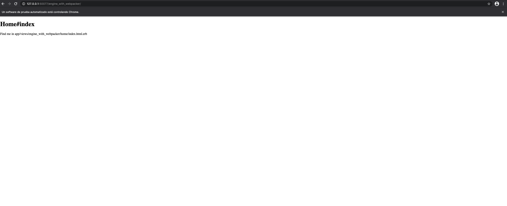

# EngineWithWebpacker

This repository has the objective of highlighting a problem with the integration of the Webpacker + Rspec + Capybara
libraries with a Rails Engine. In summary, the problem is that the compiled assets of the Rails engine, the result of
the Webpacker compilation, are not found in the test environment, as opposed to the development and production environment,
where it works according to the documentation.

###Development

**Main App - root_path**


**Engine - root_path**


###Test
**Main App - root_path**


**Engine - root_path**


**Error Test suite**


## Requirements

To run this project you must have the following programs installed:

* [Ruby 2.7.1](https://www.ruby-lang.org/en/news/2020/03/31/ruby-2-7-1-released/)
* [Node.Js](https://nodejs.org/en/download/)
* [Yarn](https://classic.yarnpkg.com/en/docs/install#mac-stable)
* [Chromedriver](https://github.com/SeleniumHQ/selenium/wiki/ChromeDriver)
* [Git](https://git-scm.com/downloads)


## Installation

Clone this repository, move inside repo and install dependencies in root repository and `spec/dummy`
folder with following commands:

```bash
bundle install
yarn install
```

#### From Development

Start webpackers servers on root repository and `spec/dummy` folder with following command:

```bash
$ ./bin/webpack-dev-server
```

Then on root repository start server
    
```bash
$ rails server
```

Enjoy EngineWithWebpacker Dummy App on [http://localhost:3000/](http://localhost:3000/)

#### From Test

Execute test suite:

```bash
$ bundle exec rspec
```
